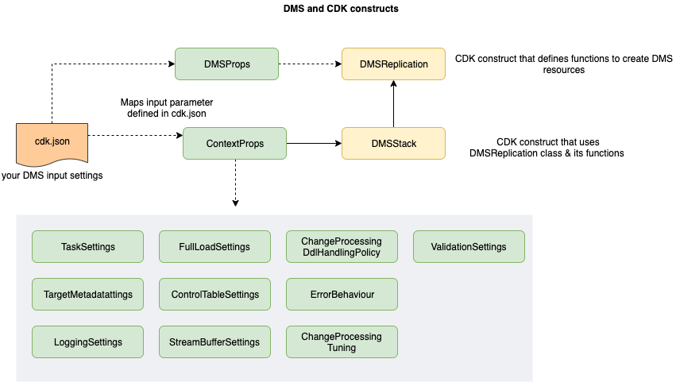

# Introduction

This CDK application contains CDK constructs to provision AWS DMS (data migration service) related resources. The solution provided is primarily based on RDS MySQL database as the source and target database used for migration. The  

1. A DMS Subnet group : Subnet group allows DMS service to choose the subnet and IP address within the subnet. DMS service uses the IP addresses from this subnet group when provisioning resources like DMS replication instance. 
1. A DMS Replication Instance : This is an managed instances where DMS replication tasks are run
1. DMS database endpoints :  Database connections to source and target database
1. DMS task(s) : Task(s) for performing data replication with configurable settings  

# Pre-requisite

1. Connectivity: The DMS service and acts as "hub" between the source and target database. So, a connectivity is needed from DMS service to both the source and database . 
   
   ___Note: If the source database in located on-premise ensure that the port (default 3306 for mysql) is opened by your corporate firewall. For configuring target endpoint, ensure that your target RDS security group allows this connectivity. The DMS service automatically validates the endpoint for connectivity during installation.___

1. Secrets Manager to store database configurations : The solution assumes all database configurations are stored in the AWS Secrets manager. Configure the secrets manager for both the source and target databases with necessary parameters like hostname, port, database, passwords needed for establishing the connectivity. Use command below to check the secrets in your account.

    ```
      aws secretsmanager list-secrets 

    ```

3. VPC endpoints for DMS, Secrets Manager. This ensures traffic is routed via AWS backbone and provides additional security. (Optional). To check the VPC endpoint run the command below and check for json output for service name like 'com.amazonaws.<aws-region>.dms' and 'com.amazonaws.<aws-region>.secretsmanager'

    ```
      aws ec2 describe-vpc-endpoints | grep dms
      aws ec2 describe-vpc-endpoints | grep secretsmanager

    ```
4. CDK v1.100.x+

5. Nodejs v 14.x+

6. Source and target databases (MySQL v5.7.4+) : Check the DMS endpoint in the **AWS Console > Services > DMS** and make sure the test connectiity is working.

# Solution Architecture

High level architecture for DMS is shown below. The main components involved are

1. A dedicated network (VPN or Direct connect) with a connectivity to the customers VPC (Virtual Private Cloud)
1. Source database preferably with a dedicated slave. This helps to offload the database load coming from read operations during migration.
1. A target RDS database instance where data is migrated.
1. Source and target DMS endpoints with database credentials stored in AWS Secrets Manager
1. DMS replication instance and a number of replication tasks for replicating the data
1. DMS subnet group is where DMS service provisions resources into your subnet for connecting to databases. Remember that the DMS service itself is hosted inside AWS.  


# Installation

Ensure that all pre-requisites are in place. The source code is repository is located at https://github.com/aws-samples/dms-cdk/

1. Install Nodejs and npm. See the link https://nodejs.org/en/download/package-manager/#macos. To check the version use the command below
    ```
      node --version
    ```

1. Install CDK for typescript (https://docs.aws.amazon.com/cdk/latest/guide/getting_started.html) or use the command below to install and check the version of CDK
    ```
      npm install -g aws-cdk 

      npm audit fix --force

      cdk --version
              
    ```
1. Create a service role "dms-vpc-role" : A service role named "dms-vpc-role" is needed if your are deploying the DMS for the first time via CLI or cloudformation in your account. The following steps are necessary to deploy the "dms-vpc-role" IAM role. For more details see the link [dms-vpc-role](https://docs.aws.amazon.com/dms/latest/userguide/CHAP_Security.html#CHAP_Security.APIRole) 
    - Create json policy file - dmsAssumeRolePolicyDocument.json - with the following content:
      ```
      {
        "Version": "2012-10-17",
        "Statement": [
        {
          "Effect": "Allow",
          "Principal": {
              "Service": "dms.amazonaws.com"
          },
        "Action": "sts:AssumeRole"
        }
      ]
      }   
      ```
    - Create the required IAM role (dms-vpc-role)
      ```
        aws iam create-role --role-name dms-vpc-role --assume-role-policy-document file://dmsAssumeRolePolicyDocument.json                    
      ```
    
    - Attach the existing policy to the new role
      ```
        aws iam attach-role-policy --role-name dms-vpc-role --policy-arn arn:aws:iam::aws:policy/service-role/AmazonDMSVPCManagementRole                    

      ```

1. Create an aws profile (if you do not have one)
    ```
        aws configure --profile dms
    ```

1. Configure cdk.json file in the project root folder. The cdk.json file is where you configure the target account to deploy your solution in addition to settings like vpc, subnet id, database schema for migrating the data.   
    ___Example of cdk.json___ 
    ```
    "context": {
        "environment": "dev",
        "account": "111111111111",

        "dev": {
          "region": "eu-central-1",
          "vpcId": "vpc-xxxxxxxxxxxxx",
          "subnetIds": [
            "subnet-xxxxxxxxxxxxxxxxa",
            "subnet-xxxxxxxxxxxxxxxxb"
          ],
          "vpcSecurityGroupIds": [
            "sg-xxxxxxxxxxxxxxxx"
          ],
          "schemas": [
            {
              "name": "demo-src-db",
              "sourceSecretsManagerSecretId": "arn:aws:secretsmanager:eu-central-1:111111111111:secret:dev/mysql/aaa-xxxxpp",
              "targetSecretsManagerSecretId": "arn:aws:secretsmanager:eu-central-1:111111111111:secret:dev/mysql/bbb-xxxxpp"
            }        
          ],
          "replicationInstanceClass": "dms.r5.4xlarge",
          "replicationInstanceIdentifier": "dms-dev-eu",
          "replicationSubnetGroupIdentifier": "dms-dev-subnet-eu",
          "replicationTaskSettings": {
          },
          "migrationType": "full-load"
        }         
      }

    ```
1. Go to your project root directory. Compile and test the solution.

   ```
    cd dms-cdk

    npm install
    
    npm test
   ```

1. Deploy the solution to your account based on cdk.json configuration. Use the 'dms' profile created previously in the cdk deploy command
   ```
    cdk deploy --profile dms
   ``` 

1. Post validation : If the deployment is sucessful you will see the cloudformation stack under **AWS Services > Cloudformation** in AWS console.
# CDK construct Overview

The solution described in this post relies mainly on 2 classes mainly - DMSReplication and DMStack and uses out of the box CDK construct library '@aws-cdk/aws-dms'
The solution is primarily designed for RDS MySQL database. However, it can easily be adopted or extended for use with other databases like PostgreSQL or Oracle.
 
- DMSReplication class is a construct responsible for creating resources such as replication instance, task settings, subnet-group and IAM role for accessing AWS Secrets Manager. Note that all database credentials are stored in AWS secrets manager.
  
- DMSStack class is a construct that leverages  DMSReplication to provision the actual  resource(s) based on parameters provided by you via cdk.json
  
- ContextProps  is a  type that helps to map input parameters from cdk.json file in a type safe manner. The cdk.json file includes settings related to DMS resources like replication instance, task settings, logging etc.  ContextProps also defines default values which can be overridden by you by defining it in the cdk.json file 

    


    ```

    import * as cdk from '@aws-cdk/core';
    import { DMSReplication } from '../lib/dms-replication';
    import * as ec2 from '@aws-cdk/aws-ec2';
    import * as rds from '@aws-cdk/aws-dms';

    export class DemoDMSStack extends cdk.Stack {
      constructor(scope: cdk.App, id: string, props?: cdk.StackProps) {
        super(scope, id, props);

        const vpc = new ec2.Vpc(this, 'DMSVpc', {});

        const dmsProps = {
          subnetIds: ['subnet-1', 'subnet-2'],
          replicationSubnetGroupIdentifier: 'dms-subnet-private',
          replicationInstanceClass: 'dms-replication-instance-t3',
          replicationInstanceIdentifier: 'dms-mysql-dev',
          migrationType: 'full-load',
          vpcSecurityGroupIds: ['sg-xxxx'],
          engineName: 'mysql',
          schemas: ['platform'],
          region: 'eu-central-1',
        };

        const dmsReplication = new DMSReplication(this, 'DMSReplicationService', dmsProps);
        const source = dmsReplication.createMySQLEndpoint(
          'db-on-source',
          'source',
          'sourceSecretsManagerSecretId',
          'sourceSecretsManagerRoleArn'
        );
        const target = dmsReplication.createMySQLEndpoint(
          'rds-target',
          'target',
          'targetSecretsManagerSecretId',
          'targetSecretsManagerRoleArn'
        );

        dmsReplication.createReplicationTask('platform-replication-task', 'platform', source, target);
      }
    }

    ```

## Configuration Options

In the cdk.json file you define the DMS related settings.

| Params                              | Description                                                                    | Default       | Required |
| ----------------------------------- | :----------------------------------------------------------------------------- | :------------ | -------- |
| environment                         | Name of your environment to deploy the CDK application                         |   dev         |  y       |        
| subnetIds                           | Subnet ids of your VPC for creating subnet group for DMS service.              |               |  y       | 
| replicationInstanceClass            | The type of DMS instance class                                                 | dms.t3.medium |  n       | 
| replicationSubnetGroupIdentifier    | The identifier of the subnet group where replication instance would be located |               |  n       |
| replicationInstanceIdentifier       | The unique identifier of the replication instance                              |               |  y       |
| migrationType                       | The type of migration. full-load or cdc or full-load-with-cdc                  | full-load     |  n       |
| sourceSecretsManagerSecretId        | ARN of secrets manager for source database credentials                         |               |  y       |
| sourceSecretsManagerRoleArn         | Role ARN to access secrets manager for sourceSecretsManagerSecretId            |               |  n       |
| targetSecretsManagerSecretId        | ARN of secrets manager for target database                                     |               |  y       |
| targetSecretsManagerRoleArn         | Role ARN to access secrets manager for sourceSecretsManagerSecretId            |               |  n       |
| allocatedStorage                    | Storage space for the replication instance (should be based on log size)       |  50g          |  n       |
| engineName                          | The name of database engine. Only mysql and maridb is allowed                  | mysql         |  n       |
| publiclyAccessible                  | If the DMS instance is publicly accessible.                                    | false         |  y       |


## Security

See [CONTRIBUTING](CONTRIBUTING.md#security-issue-notifications) for more information.

## License

This library is licensed under the MIT-0 License. See the LICENSE file.
