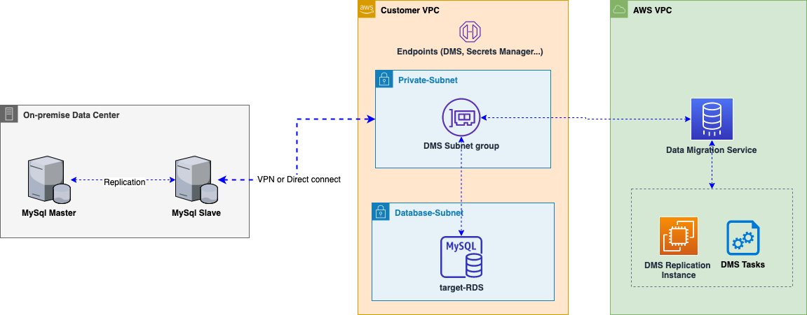

# Introduction

This CDK module contains CDK construct to provision AWS DMS (data Migration Service - v 3.4.4) and helps in quickly setting up migration infrastructure for database migration. The current version is mostly focused on MySQL database migration. DMS supports both CDC and full-load migration types. This construct provisions following resources

1. A Subnet group that defines on which customer subnet the DMS should run.
1. A DMS Replication Instance .
1. DMS database endpoints (source and target) base on database setting defined by Secrets Manager ARN
1. DMS task(s) that does the replication (full-load is the default mode) based on inputparameter provided in CDK.json

# Pre-requisite

- Connectivity: DMS needs a network connectivity between the source database and the target database. If the source database in located on-premise ensure port (default 3306 for mysql) is opened by your corporate firewall. For cnonfiguring target endpoint the security should group allow connection from the DMS subnet-group.
- Secrets Manager for Database(s) : Configure the secrets manager for both the source and target databases with necessary parameters like hostname, port, database needed for connectivity. This would be used later by DMS during endpoint(s) setup.
- VPC endpoints for DMS, Secrets Manager. This would ensure traffic is routed via AWS backbone and provides additional security.
- CDK v 1.110.x

# Solution Architecture

High level architecture for DMS is shown below. The main components are

1. A dedicated network (VPN or Direct connect) with a connectivity to the customers VPC netwwork
1. Source database preferably with a dedicated slave to offload the load coming from read operations from DMS tasks
1. A target RDS database (see DMS best practices)
1. Source and target DMS endpoints with database credentials stored in Secrets Manager
1. DMS replication instance and a number of replication tasks for replicating the data



## Performance

- When performing migration make sure you are not directly tapping the production database as this might affect its performance. Use a dedicated slave instead.
- Provide adequate instance size with IOPS needed to perform migration. The IOPS requirements during migration is much higher than during the standard database operations.

# Installation

1. Install CDK as described https://docs.aws.amazon.com/cdk/latest/guide/getting_started.html
1. Create a profile named dms

```
  $ aws configure --profile dms

```

1. Run npm and node (OS X)
   ```
     $ brew install node
     $ npm install -g npm
   ```
1. Deploy the solution using the above configured profile. Provide the account where DMS resources should be provisioned by CDK .

   ```
    $ npm install  ( compiles and installes necessary dependencies)
    $ npm test     (runs unit tests)
    cdk deploy -c environment="dev" -c account="<ACCOUNT TO DEPLOY DMS>" --profile dms

   ```

# CDK construct Overview

```
import * as cdk from '@aws-cdk/core';
import { DMSReplication } from '../lib/dms-replication';
import * as ec2 from '@aws-cdk/aws-ec2';
import { importDependencies } from './dependencies';
import * as rds from '@aws-cdk/aws-dms';

export class LibDMSStack extends cdk.Stack {
  constructor(scope: cdk.App, id: string, props?: cdk.StackProps) {
    super(scope, id, props);

    const vpc = new ec2.Vpc(this, 'DMSVpc', {});

    const dmsProps = {
      subnetIds: ['subnet-1', 'subnet-2'],
      replicationSubnetGroupIdentifier: 'dms-subnet-uk',
      replicationInstanceClass: 'dms-mysql-uk',
      replicationInstanceIdentifier: 'dms-uk',
      migrationType: 'full-load',
      vpcSecurityGroupIds: ['vpc-security'],
      engineName: 'mysql',
      schemas: ['platform'],
    };

    const dmsReplication = new DMSReplication(this, 'DMSReplicationService', dmsProps);
    const source = dmsReplication.createMySQLEndpoint(
      'db-onprem-source',
      'source',
      'sourceSecretsManagerSecretId',
      'sourceSecretsManagerRoleArn'
    );
    const target = dmsReplication.createMySQLEndpoint(
      'rds-target',
      'target',
      'targetSecretsManagerSecretId',
      'targetSecretsManagerRoleArn'
    );

    dmsReplication.createReplicationTask('platform-replication-task', 'platform', source, target);
  }
}
```

## Configuration Options

```

{
  "app": "npx ts-node --prefer-ts-exts bin/dms-cdk.ts",
  "context": {
    "environment": "dev",
    "account": "",

    "dev": {
      "region": "eu-central-1",
      "vpcId": "vpc-xxx",
      "subnetIds": [
        "subnet-xxx-1",
        "subnet-xxx-2"
      ],
      "vpcSecurityGroupIds": [
        "sg-xxx"
      ],
      "schemas": [
        {
          "name": "demo-src-db",
          "sourceSecretsManagerSecretId": "arn:aws:secretsmanager:eu-central-1:111111111111:secret:dev/SourceSecret",
          "targetSecretsManagerSecretId": "arn:aws:secretsmanager:eu-central-1:111111111111:secret:TargetRDSSecret"
        }
      ],
      "replicationInstanceClass": "dms.r5.4xlarge",
      "replicationInstanceIdentifier": "dms-dev-eu",
      "replicationSubnetGroupIdentifier": "dms-dev-subnet-eu",
      "replicationTaskSettings": {
      },
      "migrationType": "full-load-and-cdc"
    }
  }
}

```

## Security

See [CONTRIBUTING](CONTRIBUTING.md#security-issue-notifications) for more information.

## License

This library is licensed under the MIT-0 License. See the LICENSE file.
